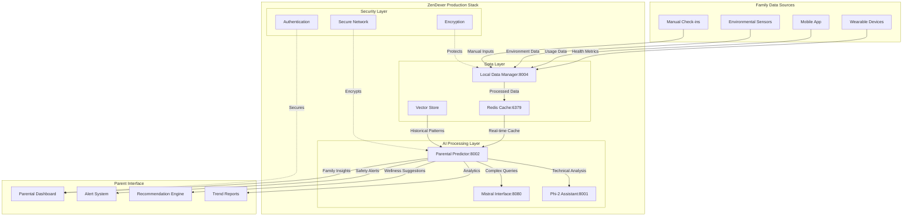

# 🏗️ Parental Predictor - Technical Architecture

## System Architecture Diagram



## Data Flow Architecture

### 1. Data Ingestion Pipeline

```yaml
Input Sources:
  Wearables:
    - Heart rate (continuous)
    - Steps (daily aggregate)
    - Sleep patterns (nightly)
    - Activity levels (hourly)

  Mobile App:
    - Screen time (daily)
    - App usage patterns
    - Mood check-ins (manual)
    - Energy ratings (manual)

  Environmental:
    - Room temperature
    - Air quality index
    - Lighting conditions
    - Noise levels

  Manual Entries:
    - Meal tracking
    - Activity logs
    - Behavioral notes
    - Parent observations
```

### 2. Processing Pipeline

```yaml
Stage 1 - Data Validation:
  - Input sanitization
  - Range validation
  - Missing data handling
  - Anomaly detection

Stage 2 - Feature Engineering:
  - Time series analysis
  - Pattern extraction
  - Normalization
  - Feature correlation

Stage 3 - Prediction Generation:
  - Real-time inference
  - Batch processing
  - Confidence scoring
  - Uncertainty quantification

Stage 4 - Output Formatting:
  - Dashboard formatting
  - Alert generation
  - Recommendation synthesis
  - Report compilation
```

## Configuration Profiles

### Development Profile

```yaml
# dev/parental-predictor.env
MODEL_TYPE=phi-2
DEPLOYMENT_MODE=development
TASK_FOCUS=local_prediction
LOCAL_INTERFACE=true
PRIVACY_MODE=local_only
DEBUG_LOGGING=true
PERFORMANCE_MONITORING=detailed
RESOURCE_LIMITS=relaxed
PREDICTION_CONFIDENCE_THRESHOLD=0.6
CACHE_SIZE=500
BATCH_SIZE=8
MODEL_QUANTIZATION=int8
```

### Production Profile

```yaml
# prod/parental-predictor.env
MODEL_TYPE=phi-2
DEPLOYMENT_MODE=production
TASK_FOCUS=parental_prediction
PARENTAL_DASHBOARD=true
CHILD_WELLNESS_TRACKING=true
PRIVACY_MODE=local_only
SECURITY_ENHANCED=true
AUDIT_LOGGING=enabled
PERFORMANCE_MONITORING=essential
RESOURCE_LIMITS=strict
PREDICTION_CONFIDENCE_THRESHOLD=0.8
CACHE_SIZE=1000
BATCH_SIZE=16
MODEL_QUANTIZATION=int4
HIGH_AVAILABILITY=true
REPLICA_COUNT=2
LOAD_BALANCING=round_robin
```

### Family-Specific Configurations

```yaml
# Large Family (5+ children)
FAMILY_SIZE=6
CHILD_AGE_GROUPS="3-5,6-8,9-11,12-14,15-17"
PREDICTION_COMPLEXITY=high
RESOURCE_ALLOCATION=premium
ALERT_FREQUENCY=moderate
REPORT_DETAIL=comprehensive

# Small Family (1-2 children)
FAMILY_SIZE=2
CHILD_AGE_GROUPS="8-10,12-14"
PREDICTION_COMPLEXITY=standard
RESOURCE_ALLOCATION=standard
ALERT_FREQUENCY=selective
REPORT_DETAIL=summary

# Special Needs Family
ACCESSIBILITY_MODE=true
ENHANCED_MONITORING=true
ALERT_SENSITIVITY=high
INTERVENTION_SUGGESTIONS=detailed
SPECIALIST_INTEGRATION=enabled
```

## Performance Optimization

### Model Optimization

```yaml
Inference Optimization:
  - Model quantization (INT4/INT8)
  - Dynamic batching
  - Caching frequently accessed predictions
  - Prefetching based on usage patterns

Memory Management:
  - Gradient checkpointing
  - Model sharding across replicas
  - Smart cache eviction
  - Memory-mapped model loading

GPU Acceleration:
  - OpenCL backend for AMD GPUs
  - CUDA fallback for NVIDIA
  - CPU fallback for compatibility
  - Mixed precision inference
```

### Scaling Strategies

```yaml
Horizontal Scaling:
  - Auto-scaling based on family count
  - Geographic distribution for latency
  - Load balancing with health checks
  - Graceful degradation under load

Vertical Scaling:
  - Dynamic resource allocation
  - Memory expansion for large families
  - CPU boost for complex predictions
  - Storage scaling for historical data
```

## Security Implementation

### Network Security

```yaml
Network Isolation:
  - Encrypted overlay networks
  - Service mesh security
  - Firewall rules
  - VPN access for admin

Data Encryption:
  - TLS 1.3 for data in transit
  - AES-256 for data at rest
  - Key rotation policies
  - Hardware security modules
```

### Access Control

```yaml
Authentication:
  - Multi-factor authentication for parents
  - Biometric options where supported
  - Session management
  - Account lockout policies

Authorization:
  - Role-based access control (RBAC)
  - Parent/guardian permissions
  - Child privacy protections
  - Emergency access protocols
```

### Privacy Protection

```yaml
Data Minimization:
  - Collect only necessary data
  - Automated data expiration
  - Anonymization techniques
  - Differential privacy

Compliance:
  - COPPA compliance for children
  - GDPR compliance for EU families
  - HIPAA considerations for health data
  - Local privacy law adherence
```

## Monitoring & Observability

### Key Metrics

```yaml
Performance Metrics:
  - Prediction latency (p50, p95, p99)
  - Throughput (predictions/minute)
  - Model accuracy (confidence scores)
  - Resource utilization (CPU, memory, GPU)

Business Metrics:
  - Family engagement rates
  - Alert response times
  - Recommendation acceptance
  - User satisfaction scores

Technical Metrics:
  - Service availability (uptime)
  - Error rates by endpoint
  - Cache hit rates
  - Model drift detection
```

### Alerting Thresholds

```yaml
Critical Alerts:
  - Service downtime > 30 seconds
  - Error rate > 5%
  - Prediction latency > 500ms
  - Memory usage > 90%

Warning Alerts:
  - Cache hit rate < 80%
  - CPU usage > 70%
  - Model confidence < 70%
  - Queue depth > 100

Info Alerts:
  - New family onboarding
  - Model version updates
  - Configuration changes
  - Scheduled maintenance
```

## Disaster Recovery

### Backup Strategies

```yaml
Data Backup:
  - Encrypted local backups (daily)
  - Cross-region replication
  - Point-in-time recovery
  - Family data export tools

Model Backup:
  - Versioned model artifacts
  - Configuration snapshots
  - Training data preservation
  - Rollback procedures
```

### Recovery Procedures

```yaml
Service Recovery:
  - Automated failover (< 30 seconds)
  - Health check restoration
  - Data consistency validation
  - Gradual traffic restoration

Data Recovery:
  - Backup restoration procedures
  - Data integrity verification
  - Family notification protocols
  - Service resumption timeline
```

---

**📊 Metrics Dashboard**: Available at `/metrics` endpoint for authorized users
**🔧 Configuration Management**: GitOps-based configuration deployment
**📈 Performance Tuning**: Continuous optimization based on usage patterns
