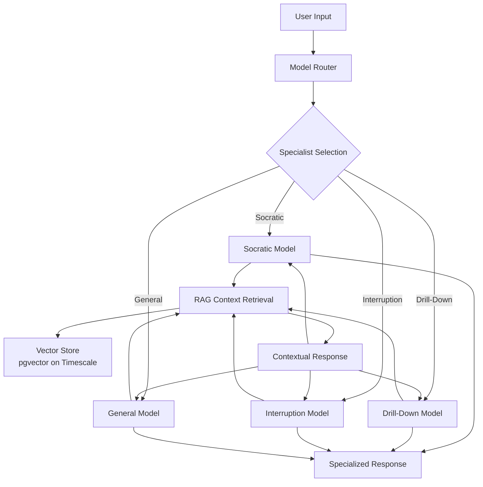

# Architecture Overview

This repo implements a local-first ingestion and retrieval stack that can bridge to Supabase services.

## High-level components

- App API: FastAPI app (minimal endpoints and health checks)
- Ingestion spool: filesystem-based batching of .msgpack frames
- Embedding: external service (or local mock) producing vectors
- Databases: Postgres/TimescaleDB with pgvector for vector search
- Caching: Redis (optional) for queues and signals
- Go Notifier: templated HTTP notifier invoked at critical lifecycle points

## Ingestion pipeline (spool → gate → ingest)

1. Writers produce .msgpack segments (optionally compressed) and land them in `spool/incoming/`.
2. A watcher opens the gate: when thresholds are met it triggers `scripts/process_spool.sh`.
3. The orchestrator atomically moves files to `spool/processing/` and marks a manifest row.
4. The Go Notifier fires a templated HTTP request (gate.open) to an external endpoint.
5. The Python replayer (`scripts/rag_replay_msgpack.py`) ingests data into Postgres/Timescale.
6. On success: files move to `spool/archive/`; notifier sends gate.done(status=success).
7. On failure: files move to `spool/failed/`; notifier sends gate.done(status=failed).

## Ingestion manifest

- Table: `ingestion_manifest` (status, files jsonb, totals, timestamps)
- Helper: `scripts/ingestion_manifest.py` provides `create_or_update_manifest()` and `finish_manifest()`
- Purpose: track batches and emit NOTIFYs (if enabled) for observability.

## Notifications (Go templated HTTP)

- Binary: `tools/notifier` (tiny CLI)
- Templates:
  - `tools/notifier/templates/gate_open.json.tmpl`
  - `tools/notifier/templates/gate_done.json.tmpl`
- Trigger points:
  - Gate open: after moving files → processing, before ingest.
  - Gate done: after ingest success/failure.
- Why Go: static binary, fast startup, simple templating and HTTP client.

## Edge/Cloud compatibility

- Supabase Edge functions can still be used for other flows.
- For Redis in Edge, prefer `npm:redis` or Upstash HTTP client.
- This architecture decouples on-prem ingestion from Edge listeners via HTTP notifications.

## Security notes

- Keep Redis and Postgres non-public or locked down; prefer TLS.
- Gate webhook endpoints should validate tokens (Bearer) and rate-limit.
- Ingestion manifest data can include non-PII metadata for observability.
# ZenGlow AI Workspace - Architecture Overview

_Last Updated: August 29, 2025_

## Project Structure

```
ZenGlowAIWorkspace/
├── 🪜 Core Application
│   ├── app/                     # Main FastAPI application
│   │   ├── core/               # Core services (config, metrics, cache)
│   │   ├── rag/                # RAG pipeline & retrieval
│   │   ├── leonardo/           # Voice-enabled Leonardo assistant
│   │   ├── audio/              # TTS/STT integration
│   │   └── health/             # Health monitoring
│
├── 🧠 Fine-Tuning Infrastructure
│   ├── fine_tuning/            # Specialized model training
│   │   ├── datasets/           # Training data (Socratic, drill-down, interruption)
│   │   ├── models/             # Trained specialist models
│   │   ├── training/           # Training scripts & workflows
│   │   ├── validation/         # Model validation & testing
│   │   └── tooling/            # LLM-as-Judge, coordination tools
│
├── 📄 Data & Knowledge
│   ├── data/                   # Raw datasets & samples
│   ├── sql/                    # Database schemas
│   ├── artifact/               # Knowledge graph artifacts
│   └── memory_snapshot.json    # System state snapshots
│
├── 🏗️ Infrastructure
│   ├── infrastructure/         # Deployment configs
│   ├── scripts/                # Automation & utilities
│   ├── docker-compose.yml      # Container orchestration
│   └── Makefile               # Build automation
│
├── 📚 Documentation
│   ├── docs/                   # Technical documentation
│   ├── README.md               # Project overview
│   ├── DEVOPS.md              # Operations guide
│   └── DEVOPS_TODO_HISTORY.md # Operational history
│
└── 🧪 Development
    ├── tests/                  # Test suites
    ├── frontend/               # Web UI components
    └── archive/                # Archived/deprecated code
```

## Architecture: Hybrid Data + Specialized Models

### 🎯 Core Concept

**Specialized Models** = Expert interaction patterns  
**RAG System** = Contextual knowledge provider  
**Integration** = Specialists leverage RAG for domain-relevant context

### 🔄 Data Flow Architecture



### 🧠 Specialized Model Types

| Specialist               | Purpose                 | Training Data                | RAG Integration                              |
| ------------------------ | ----------------------- | ---------------------------- | -------------------------------------------- |
| **Socratic Tutor**       | Question-based learning | 846 examples                 | Retrieves curriculum context for questioning |
| **Drill-Down Expert**    | Intent probing          | 648 examples                 | Gets background knowledge for deeper inquiry |
| **Interruption Handler** | Graceful interruptions  | 71 examples                  | Retrieves interrupted topic context          |
| **Base Foundation**      | Core methodology        | 500 pure + 1,842 personality | General knowledge retrieval                  |

### 🏗️ System Architecture Layers

1. **API Layer** (FastAPI)
   - Model routing & selection
   - Request/response handling
   - Health monitoring

2. **Specialist Layer** (Fine-tuned Models)
   - Domain-specific interaction patterns
   - Specialized response generation
   - Context-aware behavior

3. **RAG Layer** (Retrieval & Context)
   - Vector similarity search (pgvector on Timescale)
   - Contextual knowledge retrieval
   - Domain-specific content filtering

4. **Knowledge & Storage Layers**
   - Timescale (ZFS): Events hypertable (pgvector), partitioned activity log
   - Supabase: swarms, agents, missions, knowledge_graph, user-scoped data
   - FDW bridge on Supabase to reach Timescale (operator pushdown for vectors)
   - Conversation memory and logs

5. **Infrastructure Layer** (DevOps)
   - Docker Compose (dev) + light Swarm stack (caps, secrets)
   - Caching (Redis)
   - Monitoring & metrics

### 🎓 Example: Socratic Math Tutoring

```
1. Student: "I don't understand quadratic equations"
2. Router: Selects Socratic Specialist
3. RAG: Retrieves quadratic equation concepts, common misconceptions
4. Socratic Model + Context: "What do you think happens when we have x²?
   Have you worked with simpler equations like x + 3 = 7 before?"
5. Response: Contextually-informed Socratic questioning sequence
```

### 🔧 Technical Integration

**Interruption Handling Example:**

```
1. TTS playing explanation → User speaks → [USER_INTERRUPTION] token
2. Application Controller: Pause TTS, capture user input
3. Interruption Specialist: Process interruption gracefully
4. RAG: Retrieve context about interrupted topic
5. Response: "Great question! Let me address that..."
```

### � Privacy & Access

- PII vault with token map (mint/resolve/rotate) — see `docs/PII_ARCHITECTURE.md`
- RLS policies: users self-only, dev cross-user, guardianship access — `docs/RLS_SEED_EXAMPLE.sql`
- Swarm tables carry `owner_identity_id` for logical linkage without joining PII

### �📊 Current Capabilities

**Operational:**

- ✅ Docker Compose stack (backend, ollama, redis, webui)
- ✅ Leonardo voice integration (TTS/Whisper)
- ✅ RAG pipeline with pgvector (Timescale)
- ✅ Metrics & health monitoring

**Training Infrastructure:**

- ✅ Organized fine-tuning workspace
- ✅ 4 specialized training datasets ready
- ✅ LLM-as-Judge validation framework (Mistral7b)
- ✅ Base + specialization training strategy

**Memory Management:**

- ✅ Versioned knowledge graph snapshots
- ✅ MCP Memory → RAG integration bridge
- ✅ Automated project indexing

### �️ Services

- gRPC Router contract (`services/router/v1/router.proto`)
- gRPC Ingestion (client-streaming) (`services/ingestion/v1/ingestion.proto`)
- Go ingester scaffold (`cmd/ingester/`) — register service after codegen

### 🚀 Next Phase

**Priority Queue:**

1. **Model Training Pipeline**: Automate base + specialization training
2. **Deployment Integration**: Deploy specialists alongside RAG
3. **Model Router**: Implement specialist selection logic
6. **Ingestion Service**: Embed/dedupe/COPY batch insert with health + metrics
4. **Performance Monitoring**: Track specialist effectiveness
5. **Continuous Learning**: Feedback loops for model improvement

---

_This architecture enables domain experts (Socratic tutors, drill-down questioners) to leverage contextual knowledge (RAG) for specialized, intelligent interactions._
